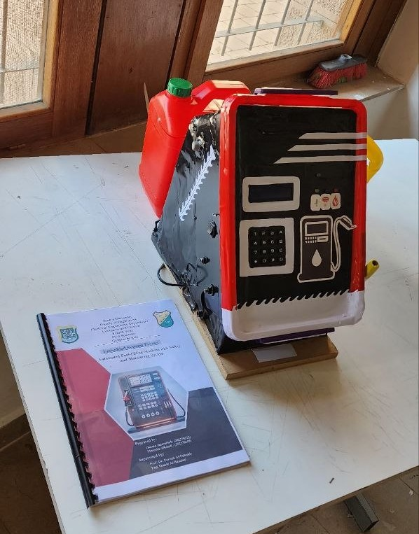
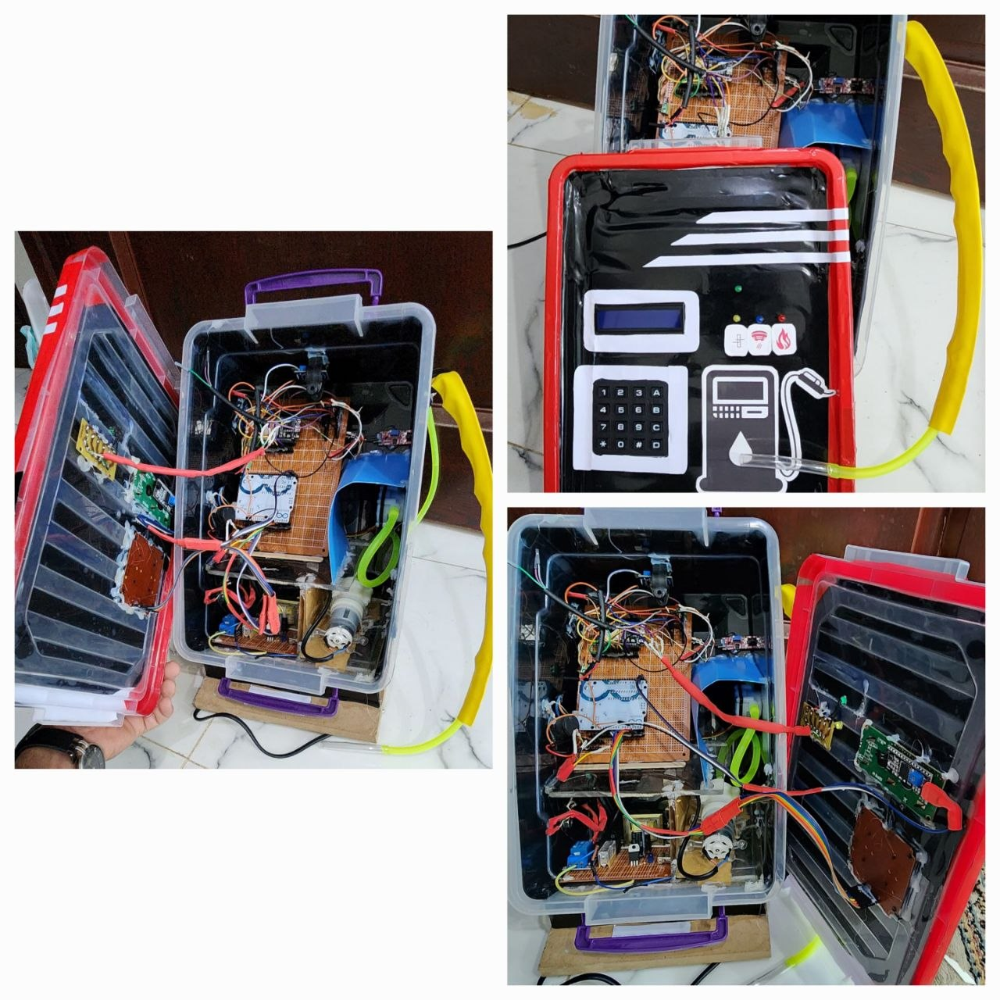
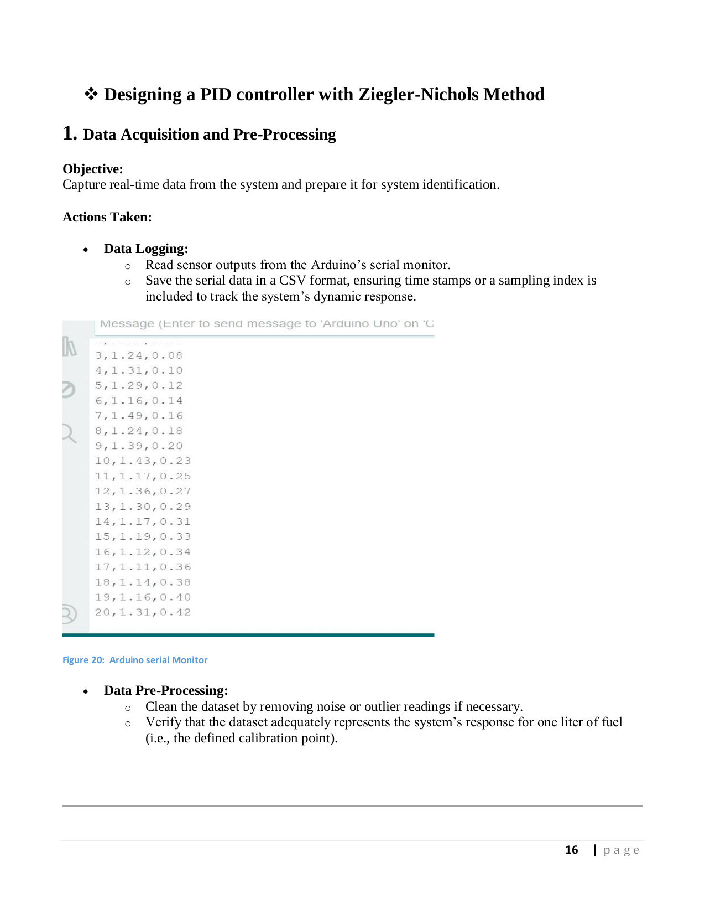
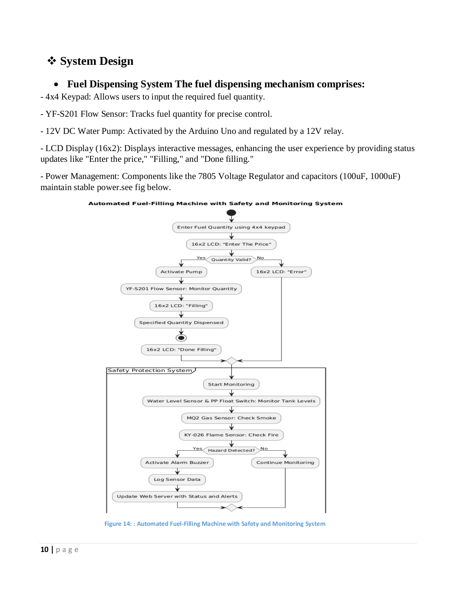
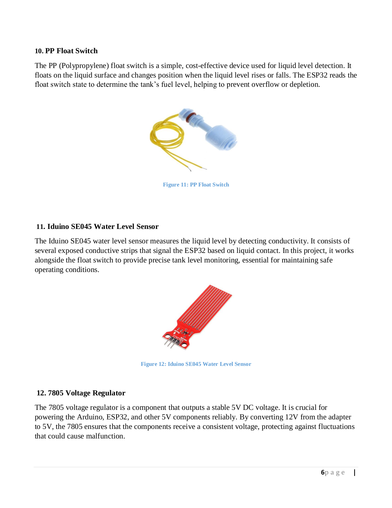
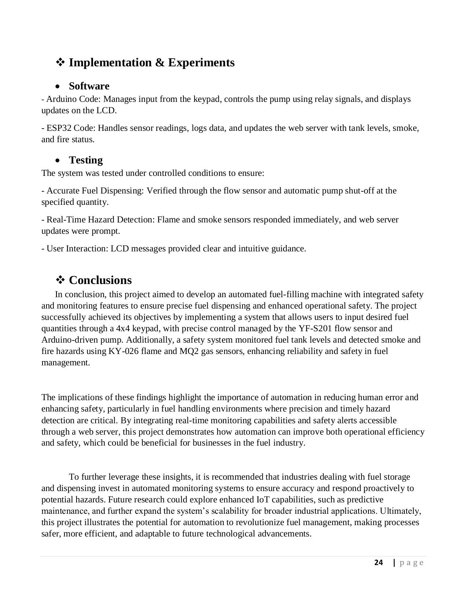
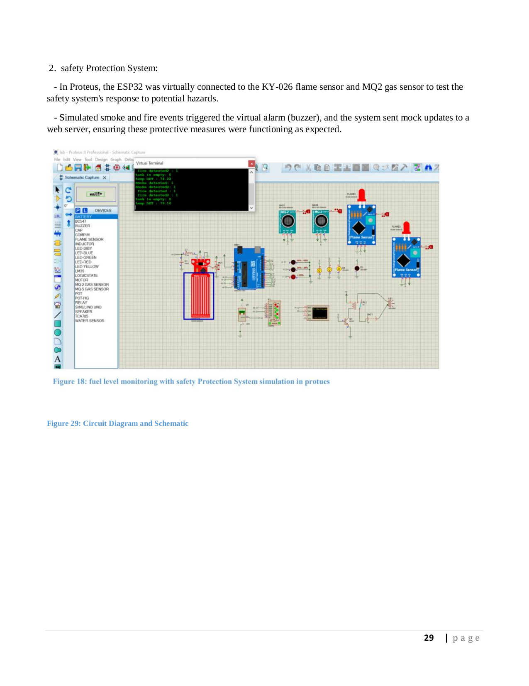

# ⛽ Automated Fuel-Filling Machine with Smart Monitoring & PID Control

A sophisticated, multi-integrated industrial automation project featuring **RFID Authentication**, **PID-controlled Dispensing**, **LabVIEW Interfacing**, and **IoT-enabled Cloud Monitoring**. This system is designed to enhance precision, security, and safety in fuel dispensing operations.

---

  
  
  
<i>Left: The physical prototype with user interface. Right: Internal circuitry and dual-microcontroller architecture.</i>

---

## 🌟 Integrated Features & Technologies
This project synthesizes three major technological domains into one cohesive system:

1.  **Digital Control (PID):** Precision liquid dispensing using MATLAB-tuned PID controllers for the YF-S201 flow sensor and 12V pump.
2.  **Industrial Interfacing (LabVIEW):** Real-time monitoring and control interface developed in LabVIEW for enhanced operator oversight.
3.  **IoT & Cloud Connectivity:** Remote hazard detection (Gas/Flame) and transaction logging via ESP32 and Arduino IoT Cloud.
4.  **Security (RFID):** Authorized access control using RFID tags to prevent unauthorized fuel dispensing.

---

## 📺 Demo Video
[Watch the Automated Fuel-Filling Machine in Action | شاهد المشروع وهو يعمل](https://drive.google.com/file/d/1kZplOqTP3Qt6xMVKvH-_tCRyLZQGjJ4M/view?usp=drivesdk)

---

## 🛠️ Hardware Architecture
The system utilizes a dual-microcontroller architecture to balance real-time control and cloud connectivity:

| Component | Role |
| :--- | :--- |
| **Arduino Mega 2560** | Main controller for PID dispensing, Keypad, and LCD. |
| **ESP32** | IoT Gateway for Cloud monitoring and safety sensors. |
| **RFID RC522** | User authentication and access control. |
| **YF-S201 Sensor** | High-precision flow measurement for PID feedback. |
| **MQ2 & KY-026** | Gas and Flame sensors for hazard detection. |
| **12V DC Pump** | Actuator for fuel dispensing via Relay control. |

---

## 📊 System Design & Control
### PID Controller Tuning
The dispensing mechanism was modeled in MATLAB/Simulink, with parameters tuned using the Ziegler-Nichols method to ensure zero steady-state error and minimal overshoot.

### LabVIEW Monitoring Interface
A dedicated LabVIEW dashboard provides a professional interface for local monitoring of fuel levels, temperature, and system status.

### IoT Cloud Dashboard
Remote monitoring is enabled via the Arduino IoT Cloud, allowing supervisors to track transactions and receive hazard alerts anywhere in the world.

---

## 📐 Schematics & Implementation
### Circuit Diagram
The integrated circuit handles the complex interactions between the RFID module, sensors, and dual microcontrollers.

### System Overview
The physical implementation features a robust internal layout with dedicated PCB designs for stability.

---

## 👥 Development Team
This project was developed by a specialized team at **Sana'a University**:
- **Mutasim Al-Kamil** ([GitHub](https://github.com/Asoomkamel))
- **Osama Mohammed Moawad**

**

---
*© 2024-2025 Sana'a University - Faculty of Engineering*
